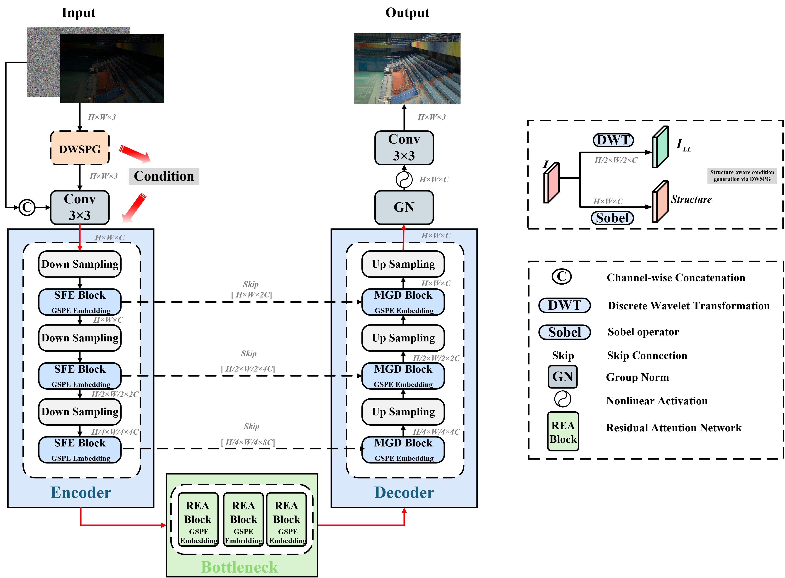

# CS³-Diff: Collaborative Spatio-Spectral-Scale Guided Diffusion for Low-Light Image Enhancement

# 📌 Overview

Low-light image enhancement aims to improve visual quality and support robust downstream vision tasks under challenging illumination conditions. Existing methods often suffer from inadequate structural preservation, texture degradation, and spatial inconsistency during patch-wise inference. To address these issues, we propose **CS³-Diff**, a collaborative spatio-spectral-scale guided diffusion framework for low-light image enhancement. Specifically, a Dual-stage Wavelet-based Structural Prior Guidance (DWSPG) module is designed to extract and enhance edge-aware structural priors in the wavelet domain. A Global-Scale Positional Embedding (GSPE) is introduced to jointly encode diffusion timesteps, spatial coordinates, and scale information for globally consistent restoration. In addition, a Residual Frequency-domain Phase Mixer (RFPM) is proposed to improve fine-grained texture reconstruction through explicit phase-aware frequency modeling. 



---
# 🔑 Core Contributions

- (a) Enhancement stage of DWSPG
- (b) Fusion stage of DWSPG
- (c) Architecture of a single Fusion Branch.

  
- Global-Scale-Position Embedding module(GSPE).

# ⚙️ Environment Setup

```bash
- Platform: NVIDIA GPU with CUDA support (recommended)  
- Python: 3.8  
```
Install PyTorch and project dependencies:

```bash
pip install torch torchvision torchaudio
pip install -r requirements.txt
```

---

# 📂 Repository Structure
```text
├── models/        # Model implementations
├── datasets/      # Dataset loaders
├── utils/         # Utilities and metrics
├── configs/       # Configuration files
├── checkpoints/   # Pretrained models
```


# 📊 Dataset 

We evaluate CS³-Diff on the following benchmark datasets:

- LOL-v1
- LOL-v2-Real
- LOL-v2-Synthetic
- LSRW

Download the datasets and organize them under:
```bash
./datasets/scratch/LLIE
```
Directory structure:
```text
LLIE
├── LOLv1
│   ├── train
│   │   ├── input
│   │   └── gt
│   └── test
│       ├── input
│       └── gt
├── LOLv2-Real_captured
├── LOLv2-Synthetic
├── LSRW
```
Please ensure the directory structure is strictly followed.

# 📦 Pre-trained Models

Pretrained checkpoints:

Baidu Cloud: https://pan.baidu.com/s/1UuqeO4yuhZ2JhcgtHIfRMg
Extraction code: 9912

Place the downloaded files under:
```bash
./checkpoints
```

# 🧪 Inference 

Run evaluation with:
```bash
python inference.py --config configs/lowlight.yml --checkpoint <checkpoint_path>
```
Example:
```bash
python inference.py --config configs/lowlight.yml --checkpoint checkpoints/lolv2-real.pth
python inference.py --config configs/lowlight.yml --checkpoint checkpoints/lolv2-syn.pth
python inference.py --config configs/lowlight.yml --checkpoint checkpoints/lolv1.pth
python inference.py --config configs/lowlight.yml --checkpoint checkpoints/lsrw.pth
```
# 📝 Experimental Results


#  📌 Notes
- This repository provides the implementation of CS³-Diff.
- Please refer to the paper for more architectural and theoretical details.
